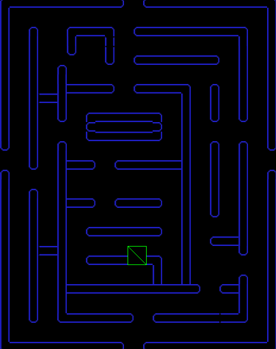

# Entry 5
##### 4/26/2025

## Freedom Project MVP (my version of pac-man, sheep-pac)
First I started my making my map and importing it using phaser 3 js code.

## Engineering Design Process (EDP)
I am now in the Fourth stage of the engineering design process. I will start building anf finishing my MVP then move on to building Beyond the MVP.

## Skills
### Being on Task
Being on task and maintaining focus is very important when it comes to finishing work on time. To help me maintian focus I like to be in a quite room with my phone or any distractions hidden away from my sight. Being able to maintain focus and finishing on task will do you a big favor after. It might feel tempting to just take a break and relax but trust me after You finish your work it feels 10x better relaxing. For this part of the Freedom Project is was very hard for me to stay on task and I often forgot to do work like my second learning log because there were work from other classes that were piling up. To help me stay on task in the future, I will be sure to not procrasinate and always keep a list of tasks that I have to finish on my phone.

### Time Management
Managing my own time in this part of the freedom project was crucial because I had to make sure that I had enough time to finish my work for other classes and at the same time have time to tinker with my tool.

## Next Steps
Next I plan on making it Beyond MVP.

[Previous](entry04.md) | [Next](entry06.md)

[Home](../README.md)
